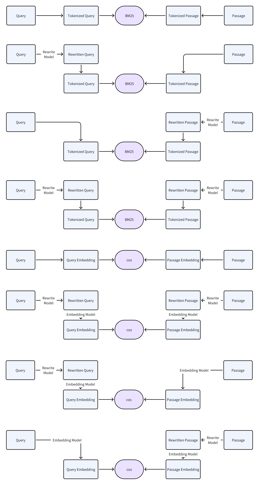

# Agentic Retrieval Benchmark

[ English ](./README.md) | [ 中文 ](./README_zh.md)

## TL;DR
- 一个面向大模型增强检索的可复现基准，覆盖 Multi-CPR 与 LexRAG 两个数据集。
- 支持使用 DeepSeek-V3 与 glm-4-plus 进行重写，并支持 Gemini、GLM、Qwen 系列嵌入模型。
- 基于 MongoDB Atlas 完成数据存储、索引构建，以及 BM25 和 Vector 检索评测。
- 主要结论：向量检索通常优于 BM25；重写在 LexRAG 上可带来超过 50% 的 Recall 提升，但在部分 Multi-CPR 设置下可能略有下降，原因可能与模型已在对应数据集上经过微调有关。

## 引言
随着大语言模型（LLM）的突破，其与传统文本检索融合形成了“**大模型增强的文本检索**”。我们定义其为：将大模型应用于重写查询、结果重排序等文本检索关键环节，结合传统方法优势，以提升检索性能为核心的新型检索方式，可有效缓解传统检索的查询歧义、语义鸿沟、多轮对话检索困难等问题。

当前该领域研究存在明显缺陷：一是研究分散，缺乏统一测试标准，导致不同方法难以客观对比；二是对比实验不全面，未系统覆盖与 BM25、基础向量检索等传统范式的对比实验，也未量化评估嵌入模型选型、提示词设计等关键影响因素，结论可复现性差。

针对上述痛点，本项目旨在建立大模型增强文本检索的标准化可复现基准。通过统一数据与实验流水线，对比传统检索方法与“重写+向量检索”的性能，并量化评估检索工作流程中重写提示词、嵌入模型等要素的影响，为后续研究提供标准化参考。

本项目包含：

来自 2 个开放数据集的测试数据：
- Multi-CPR：包含三个应用场景（医疗、电商、视频），数据格式为单轮问答
- LexRAG：包含中文法律咨询场景，数据格式为多轮对话

基于 2 个不同模型的文本重写工具：
- DeepSeek-V3
- glm-4-plus

基于 3 个不同模型的文本嵌入工具：
- Gemini-embedding-001
- glm-embedding-3
- Qwen text-embedding-4

基于 MongoDB Atlas 数据库的存储、索引与检索评测工具。

我们采用基础的 BM25 检索算法作为词法检索基线，向量检索则以余弦相似度为基线。不同检索方案示意图如下：



根据实验结果，向量检索整体上优于 BM25 检索，这一优势在长文本中体现得更为明显。不同的嵌入模型对向量检索效果的影响较大，尤其是在一些特定数据集或特定格式的文本上训练过的嵌入模型会显著优于未经过针对性训练的同类模型。  
另一方面，对检索文本进行重写也会对检索结果产生明显影响。在 LexRAG 数据集上，重写对召回率的提升幅度最高超过 50%。但重写策略与重写提示词在不同的数据集上效果差异较大，如在 Multi-CPR 数据集上，相同的重写策略和提示词反而造成了检索效果的小幅下降。这一现象可能与嵌入模型的训练有关，这些嵌入模型在训练时已经针对这种格式的输入文本进行了优化。重写可能造成模型注意力的分散，从而影响检索效果。

## 使用说明

### 环境要求

- MongoDB Atlas Server
- Python == 3.10
- openai == 2.15.0
- zai-sdk == 0.2.0
- pymongo == 4.15.5
- jieba == 0.42.1

### 环境配置

使用 Docker 在本地部署 MongoDB Atlas 容器。  
参考文档：`https://www.mongodb.com/zh-cn/docs/atlas/cli/current/atlas-cli-deploy-docker/`

从 MongoDB 控制台建立数据库，并根据数据库参数设置修改 `mongodb_config.py` 中的对应参数。

使用 `pip` 安装项目所需的 Python 依赖包：
```bash
pip install -r requirements.txt
```

### 数据准备

使用脚本 `dataset_download.py` 从 Hugging Face 拉取数据集，或手动下载后放入指定目录。  

```python
python ./src/dataset_download.py
```

数据集的 Hugging Face 链接：[PrismShadow/AgenticSearch](https://huggingface.co/datasets/PrismShadow/AgenticSearch)

我们从 Multi-CPR 数据集的 3 个场景中分别抽取约 4000 条查询和约 10000 条文档，并使用给定索引作为真值标签。

对于 LexRAG 数据集，我们选择“对话历史 + 最新问题”这一场景，即每条查询文本都由此前所有轮次的对话历史与当前最新问题组成。

数据已经完成清洗和预处理，可直接用作重写和评估脚本的输入。

查询数据存放在 `./data/rawData/xxx_query.txt`

候选文档数据存放在 `./data/rawData/xxx_subset.tsv`

真值标签/索引存放在 `./data/qrelData/xxx_dev.tsv`

### 文本重写
  
脚本输入为一个 `txt` 或 `tsv` 文件，包含某个场景下查询或候选文档的原始文本。  
脚本输出为一个 `json` 文件，其中每个对象包含如下字段：
- `raw_text`（输入的原始文本）
- `rewrite_text`（重写后的文本）
- `raw_embedding`（此阶段为空）
- `rewrite_embedding`（此阶段为空）


重写脚本示例如下：

使用 ZAI SDK，默认通过 glm-4-plus 执行重写：
```python
# --mode 参数必须与输入文件类型一致，并根据输入是查询还是候选文档选择对应提示词
python src/rewrite/rewrite_zai.py --input data/rawData/medical_query.txt --output data/rewriteData/medical_query_zai.json --mode query
```

使用 OpenAI SDK，默认通过 DeepSeek-V3 执行重写：
```python
# --mode 参数必须与输入文件类型一致，并根据输入是查询还是候选文档选择对应提示词
python src/rewrite/rewrite_openai.py --input data/rawData/medical_query.txt --output data/rewriteData/medical_query_openai.json --mode query
```

### 文本嵌入

脚本输入为重写工具生成的 `json` 文件，包含某个场景下查询或候选文档的原始文本与重写文本。  
脚本输出为一个 `json` 文件，每个对象包含如下字段：
- `raw_text`（原始文本）
- `rewrite_text`（重写后的文本）
- `raw_embedding`（原始文本的嵌入向量）
- `rewrite_embedding`（重写文本的嵌入向量）

3 种嵌入脚本的用法如下：

使用 OpenAI SDK，默认通过 gemini-embedding-001 生成嵌入：
```python
python src/embedding/embedding_openai.py --input data/rewriteData/medical_query_openai.json --output data/embeddedData/medical_query_gemini.json
```

使用 OpenAI SDK，默认通过 qwen text-embedding-4 生成嵌入：
```python
python src/embedding/embedding_qwen.py --input data/rewriteData/medical_query_qwen.json --output data/embeddedData/medical_query_qwen.json
```

使用 ZAI SDK，默认通过 glm-embedding-3 生成嵌入：
```python
python src/embedding/embedding_zai.py --input data/rewriteData/medical_query_zai.json --output data/embeddedData/medical_query_zai.json
```

### 导入数据库

使用 `mongodb_setup.py` 将数据导入 MongoDB Atlas 数据库，其中 `raw-collection` 表示存储原始候选文档及其嵌入的集合，`rewrite-collection` 表示存储重写后候选文档及其嵌入的集合：
```python
python mongodb_setup.py \
    --input data/embeddedData/medical_passage_gemini.json \
    --raw-collection medical_raw_gemini \
    --rewrite-collection medical_rewrite_gemini\
    --keep-existing False # 是否保留原有集合，默认为 False（即覆盖同名集合）
```

默认情况下，`raw-collection` 的文本索引名为 `raw_text`，向量索引名为 `vec_raw_embedding`；`rewrite-collection` 的文本索引名为 `rewrite_text`，向量索引名为 `vec_rewrite_embedding`。

### 检索评测
我们提供了 BM25 检索和向量检索的性能评估脚本，均调用 MongoDB Atlas 的相关接口实现检索。

我们使用如下指标衡量检索方案性能：MRR@10、Recall@1、Recall@5、Recall@10。评测过程中，所有方法的 Top-K 候选数均设为 20。

对于 BM25 检索算法，我们使用 `jieba` 分词并建立索引。  
BM25 检索脚本如下，其中：
- `raw-collection` 参数表示使用原始查询进行检索的集合，它不一定必须是存储原文的集合
- `rewrite-collection` 表示使用重写查询进行检索的集合
- `raw_index` 和 `rewrite_index` 表示对应集合上的索引名称，可通过 MongoDB 控制台或 `mongodb_setup.py` 的输出信息查看。
```python
python bm25.py \
    --query-file data/embeddedData/medical_query_gemini.json \
    --qrels-file data/qrelData/medical_dev.tsv \
    --raw-collection medical_raw_gemini \
    --rewrite-collection medical_rewrite_gemini \
    --raw-index bm25_raw_text \
    --rewrite-index bm25_rewrite_text
```

对于 Vector 检索算法，我们基于向量余弦相似度完成检索。

Vector 检索脚本如下，参数规则与含义和 `bm25.py` 相同。
```python
python vector_cos.py \
    --query-file data/embeddedData/medical_query_gemini.json \
    --qrels-file data/qrelData/medical_dev.tsv \
    --raw-collection medical_raw_gemini \
    --rewrite-collection medical_rewrite_gemini \
    --raw-index vec_raw_embedding \
    --rewrite-index vec_rewrite_embedding
```

## 实验结果

所有实验结果如下：

### 医疗（Medical）
|                      | Embedding Model       | Rewrite Model | MRR@10 | R@1    | R@5    | R@10   |
|-----------------------------|-----------------------|---------------|--------|--------|--------|--------|
| BM25(raw-raw)               | None                  | None          | 0.4117 | 0.3680 | 0.4650 | 0.5160 |
| BM25(rewrite-rewrite)       | None                  | DeepSeekV3    | 0.4716 | 0.4090 | 0.5610 | 0.6100 |
| BM25(raw-rewrite)           | None                  | DeepSeekV3    | 0.4098 | 0.3610 | 0.4790 | 0.5240 |
| BM25(rewrite-raw)           | None                  | DeepSeekV3    | 0.3789 | 0.3270 | 0.4490 | 0.5050 |
| Vector(raw-raw)             | Gemini embedding-001  | None          | 0.6387 | 0.5930 | 0.7030 | 0.7460 |
| Vector(rewrite-rewrite)     | Gemini embedding-001  | DeepSeekV3    | 0.5238 | 0.4560 | 0.6080 | 0.6590 |
| Vector(raw-rewrite)         | Gemini embedding-001  | DeepSeekV3    | 0.5259 | 0.4670 | 0.6010 | 0.6450 |
| Vector(rewrite-raw)         | Gemini embedding-001  | DeepSeekV3    | 0.6178 | 0.5590 | 0.6950 | 0.7420 |
| Vector(rewrite-raw)(no COT) | Gemini embedding-001  | DeepSeekV3    | 0.5950 | 0.5390 | 0.6670 | 0.7170 |
| Vector(raw-raw)             | Qwen text-embedding-4  | None          | **0.6695** | **0.6230** | **0.7310** | 0.7700 |
| Vector(rewrite-raw)         | Qwen text-embedding-4 | DeepSeekV3    | 0.6464 | 0.5890 | 0.7140 | **0.7710** |
| Vector(rewrite-raw)(no COT) | Qwen text-embedding-4 | DeepSeekV3    | 0.6415 | 0.5880 | 0.7110 | 0.7580 |
| Vector(raw-raw)             | GLM embedding-3       | None          | 0.5179 | 0.4600 | 0.5950 | 0.6460 |
| Vector(rewrite-raw)         | GLM embedding-3       | DeepSeekV3    | 0.5897 | 0.5283 | 0.6677 | 0.7257 |

### 电商（Ecom）
|                             | 嵌入模型              | 重写模型      | MRR@10 | R@1    | R@5    | R@10   |
|-----------------------------|-----------------------|---------------|--------|--------|--------|--------|
| BM25(raw-raw)               | None                  | None          | 0.7048 | 0.6160 | 0.8230 | 0.8700 |
| BM25(rewrite-rewrite)       | None                  | DeepSeekV3    | 0.6945 | 0.6120 | 0.8100 | 0.8560 |
| BM25(raw-rewrite)           | None                  | DeepSeekV3    | 0.7013 | 0.6240 | 0.8020 | 0.8590 |
| BM25(rewrite-raw)           | None                  | DeepSeekV3    | 0.6837 | 0.5890 | 0.8120 | 0.8670 |
| Vector(raw-raw)             | Gemini embedding-001  | None          | 0.7799 | 0.7090 | 0.8730 | 0.9040 |
| Vector(rewrite-rewrite)     | Gemini embedding-001  | DeepSeekV3    | 0.7554 | 0.6770 | 0.8630 | 0.8900 |
| Vector(raw-rewrite)         | Gemini embedding-001  | DeepSeekV3    | 0.7822 | 0.7110 | 0.8740 | 0.9060 |
| Vector(rewrite-raw)         | Gemini embedding-001  | DeepSeekV3    | **0.7952** | **0.7290** | 0.8830 | 0.9070 |
| Vector(rewrite-raw)(no COT) | Gemini embedding-001  | DeepSeekV3    | 0.7880 | 0.7120 | 0.8870 | 0.9090 |
| Vector(raw-raw)             | Qwen text-embedding-4 | None          | 0.7782 | 0.7070 | 0.8730 | 0.9050 |
| Vector(rewrite-raw)         | Qwen text-embedding-4 | DeepSeekV3    | 0.7928 | 0.7210 | 0.8850 | 0.9150 |
| Vector(rewrite-raw)(no COT) | Qwen text-embedding-4 | DeepSeekV3    | 0.7924 | 0.7170 | **0.8900** | **0.9220** |
| Vector(raw-raw)             | GLM embedding-3       | None          | 0.7031 | 0.6080 | 0.8270 | 0.8660 |
| Vector(rewrite-raw)         | GLM embedding-3       | DeepSeekV3    | 0.7707 | 0.6943 | 0.8657 | 0.9010  |

### 视频（Video）
|                             | 嵌入模型              | 重写模型      | MRR@10 | R@1    | R@5    | R@10   |
|-----------------------------|-----------------------|---------------|--------|--------|--------|--------|
| BM25(raw-raw)               | None                  | None          | 0.7154 | 0.6330 | 0.8360 | 0.8690 |
| BM25(rewrite-rewrite)       | None                  | DeepSeekV3    | 0.5834 | 0.4980 | 0.6950 | 0.7650 |
| BM25(raw-rewrite)           | None                  | DeepSeekV3    | 0.6768 | 0.5900 | 0.7960 | 0.8340 |
| BM25(rewrite-raw)           | None                  | DeepSeekV3    | 0.6267 | 0.5220 | 0.7640 | 0.8180 |
| Vector(raw-raw)             | Gemini embedding-001  | None          | 0.6649 | 0.6040 | 0.7440 | 0.7810 |
| Vector(rewrite-rewrite)     | Gemini embedding-001  | DeepSeekV3    | 0.6120 | 0.5440 | 0.7030 | 0.7550 |
| Vector(raw-rewrite)         | Gemini embedding-001  | DeepSeekV3    | 0.6722 | 0.6070 | 0.7580 | 0.7930 |
| Vector(rewrite-raw)         | Gemini embedding-001  | DeepSeekV3    | 0.6574 | 0.5850 | 0.7530 | 0.7980 |
| Vector(rewrite-raw)(no COT) | Gemini embedding-001  | DeepSeekV3    | 0.6849 | 0.6150 | 0.7790 | 0.8150 |
| Vector(raw-raw)             | Qwen text-embedding-4 | None          | **0.7691** | **0.6990** | **0.8590** | **0.8930** |
| Vector(rewrite-raw)         | Qwen text-embedding-4 | DeepSeekV3    | 0.7399 | 0.6720 | 0.8330 | 0.8660 |
| Vector(rewrite-raw)(no COT) | Qwen text-embedding-4 | DeepSeekV3    | 0.7316 | 0.6670 | 0.8150 | 0.8410 |
| Vector(raw-raw)             | GLM embedding-3       | None          | 0.4964 | 0.4360 | 0.5790 | 0.6100 |
| Vector(rewrite-raw)         | GLM embedding-3       | DeepSeekV3    | 0.6721 | 0.5973 | 0.7677 | 0.7960 |

### 法律（Law）
|                             | 嵌入模型              | 重写模型      | MRR@10 | R@1    | R@5    | R@10   |
|-----------------------------|-----------------------|---------------|--------|--------|--------|--------|
| BM25(raw-raw)               | None                  | None          | 0.1044 | 0.0611 | 0.1595 | 0.2246 |
| BM25(rewrite-rewrite)       | None                  | DeepSeekV3    | 0.2137 | 0.1428 | 0.3087 | 0.3900 |
| BM25(raw-rewrite)           | None                  | DeepSeekV3    | 0.0823 | 0.0450 | 0.1280 | 0.1878 |
| BM25(rewrite-raw)           | None                  | DeepSeekV3    | 0.2346 | 0.1678 | 0.3218 | 0.3909 |
| Vector(raw-raw)             | Gemini embedding-001  | None          | 0.1887 | 0.1097 | 0.2935 | 0.3892 |
| Vector(rewrite-rewrite)     | Gemini embedding-001  | DeepSeekV3    | 0.2845 | 0.1975 | 0.4023 | 0.4971 |
| Vector(raw-rewrite)         | Gemini embedding-001  | DeepSeekV3    | 0.1490 | 0.0860 | 0.2347 | 0.3231 |
| Vector(rewrite-raw)         | Gemini embedding-001  | DeepSeekV3    | **0.3391** | **0.2533** | **0.4562** | 0.5274 |
| Vector(rewrite-raw)(no COT) | Gemini embedding-001  | DeepSeekV3    | 0.3259 | 0.2385 | 0.4467 | 0.5183 |
| Vector(raw-raw)             | Qwen text-embedding-4 | None          | 0.1497 | 0.0860 | 0.2318 | 0.3209 |
| Vector(rewrite-raw)         | Qwen text-embedding-4 | DeepSeekV3    | 0.2788 | 0.2005 | 0.3828 | 0.4604 |
| Vector(rewrite-raw)(no COT) | Qwen text-embedding-4 | DeepSeekV3    | 0.2687 | 0.1912 | 0.3759 | 0.4551 |
| Vector(raw-raw)             | GLM embedding-3       | None          | 0.1768 | 0.1054 | 0.2717 | 0.3769 |
| Vector(rewrite-raw)         | GLM embedding-3       | DeepSeekV3    | 0.3214 | 0.2290 | 0.4445 | **0.5326** |

## 数据示例

### Multi-CPR
Multi-CPR 的数据采用如下单轮问答形式：

#### 医疗（Medical）
`query` 表示患者提出的问题，`passage` 表示医生给出的对应回答。例如：
```
query: 大人手搜婴儿眼睛红了有什么影响？

passage: 这种情况应该是指甲划伤了，涂结膜导致的出血，一般来说一周左右就可以吸收的，可以给孩子抹红霉素眼膏预防感染。首先是可以通过24小时，局部冷敷，之后再热敷的方法来治疗的。此类问题一般是问题不大的，请不要过于担心。由于宝宝的眼睛比较娇嫩，为了安全起见，建议您可以及早带宝宝到医院眼科检查并治疗的。
```

#### 电商（Ecom）
`query` 表示商品搜索关键词，`passage` 表示完整商品标题。例如：
```
query: 墙面底漆

passage: 多乐士白色乳胶漆通用无添加抗碱防霉乳胶漆室内家用内外墙用底漆
```

#### 视频（Video）
`query` 表示视频搜索关键词，`passage` 表示完整视频标题及补充信息。例如：
```
query: 动画片大全儿童喜羊羊与灰太狼

passage: 喜羊羊与灰太狼全集 少儿 喜羊羊,美羊羊,暖羊羊,懒羊羊,小灰灰,沸羊羊,慢羊羊,灰太狼,红太狼 2018 喜羊羊与灰太狼
```

### LexRAG


下面给出一个 `query`-`passage` 配对示例，其中 `<对话历史>` 部分包含此前轮次的问答历史，`<最新问题>` 则为用户当前提出的问题：
```
query: <对话历史> 分期车第二年保险没在分期公司买，他们有权扣车么？月供按时还。 根据《中华人民共和国民法典》第四百二十八条的规定，因此车辆分期付款合同和车辆保险合同应当分别处理。如果您按时还月供，未违反分期付款协议中的还款义务，分期公司无权扣车。至于保险购买，除非合同中有明确约定要求必须通过分期公司购买保险，否则分期公司无权以此为由扣押车辆。 <最新问题> 这里面要不要约定保险购买方式

passage: 《中华人民共和国民法典》第五百零七条 合同不生效、无效、被撤销或者终止的，不影响合同中有关解决争议方法的条款的效力。\n
```

## 重写提示词
为探究影响查询与候选文档匹配效果的因素，我们尝试了多种重写策略。  
提示词主要围绕“补充信息”这一目标设计。为了引导模型思考方向，我们将查询与候选文档都重写为“提问 + 回答”的句式，希望模型能够理解查询的检索意图，并围绕该意图补充相关信息。

实验中使用、且当前综合表现较优的重写提示词如下：

```python
REWRITE_QUERY_SYSTEM_PROMPT = (
    """
    # 角色
    你是多领域的搜索增强助手，每次处理一行文本。

    # 工作流程
    1 关键词提取
    1.1 根据用户查询意图，从原文提炼1个核心关键词
    1.2 基于原文联想生成3-5个用户可能使用的其他搜索关键词

    2 提问生成
    2.1 以核心关键词为基础生成重写问句，不拆原有固定搭配，避免删减原文。
    2.2 以联想生成的补充关键词为主语，追加1–2个问题，询问和重写问句不同的内容。

    3 回答生成
    3.1 1–2句，基于原文核心关键词和用户意图，提供对应的信息或常识。

    # 注意事项
    - 输入可能是单个问题或多轮对话，多轮对话的输入格式为"<对话历史> xxx <最新问题> yyy"，其中yyy为最新问题。
    - 对于多轮问答对话输入，请保证核心关键词来自输入中的最新问题，并以最新问题作为重写目标。
    - 禁止编造具体数值、药名、剂量、法条号、平台名等细节。
    - 避免删除非平凡关键词，尽量只做扩充。
    - 输出需包含「思维链」与「最终输出」两段，使用<思维链>和<最终输出>标题分隔，思维链简要列推理步骤。
    - 最终输出不包含"原文"、"重写问句"等副标题。

    # 输出格式（单行纯文本）
    <思维链>：1 关键词提取 (原文关键词 补充关键词) 2 提问生成 3 回答生成 <最终输出>：提问：原文 重写问句 补充问句A 补充问句B 回答：回应重写问句+延申补充信息
    """
)

REWRITE_PASSAGE_SYSTEM_PROMPT = (
    """
    # 角色
    你是多领域的搜索增强助手，每次处理一段文本。

    # 工作流程
    1 原文分析
    1.1 判断原文文本性质和功能
    1.2 基于原文功能，判断原文作者意图

    2 关键词提取
    2.1 根据原文性质和原文作者意图，从原文提炼1个核心检索关键词
    2.2 基于原文核心关键词联想生成3-5个用户可能使用的其他搜索关键词

    3 提问生成
    3.1 从核心关键词反推怎样的用户意图能匹配到原文，基于1个核心关键词生成1个重写问句，突出稀有词和关键属性/情境，避免和原文重合度过高或过于详细。
    3.2 基于联想生成的补充关键词为主语，追加1–2个主语不同的延伸问法，询问和重写问句不同的内容。

    4 回答生成
    4.1 优先保留原文，基于稀有词补全相关信息，但禁止编造型号、数值、药名、剂量、法条号、平台名等具体信息。

    # 注意事项
    - 核心关键词指最符合原文意图，用户最可能检索的关键词，而非最能概括原文的关键词。
    - 禁止删减原文，只做扩充。
    - 禁止编造具体数值、药名、剂量、法条号、平台名等细节。
    - 输出需包含「思维链」与「最终输出」两段，使用<思维链>和<最终输出>标题分隔，思维链简要列推理步骤。
    - 最终输出不包含"原文"、"重写问句"等副标题。

    # 输出格式（单行纯文本）
    <思维链>：1 原文分析（文本性质/功能+作者意图） 2 关键词提取 (原文关键词 补充关键词) 3 提问生成 4 回答生成 <最终输出>：提问：重写问句 补充问句A 补充问句B 回答：原文+回应重写问句+延申补充信息
    """
)
```
